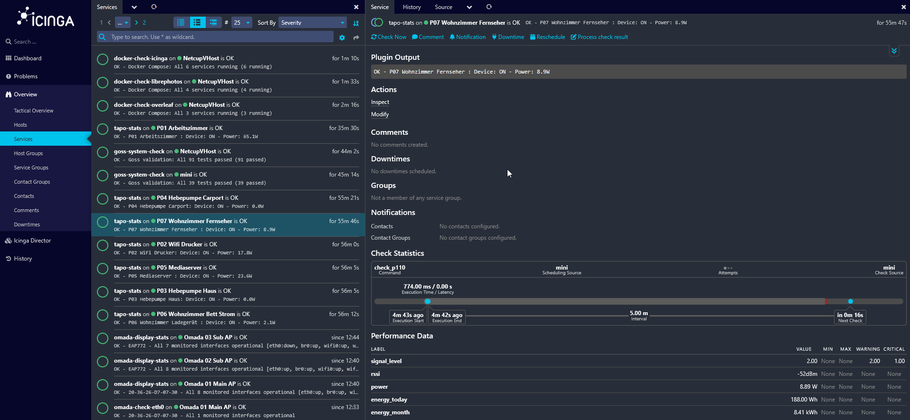

# Nagios Plugins Collection

My personal nagios plugins, suited for my environment



## Overview

These plugins are tested only by me using them in my own environment

## Available Plugins

- check_gmodem2 - Telekom Glasfasermodem 2 fiber optic modem monitoring
- check_p110 - TP-Link P110 smart plug monitoring with KLAP protocol
- check_jetdirect - Network printer monitoring via SNMP
- check_goss - Infrastructure validation using Goss framework
- check_compose - Docker Compose service health monitoring
- check_eap772 - TP-Link Omada EAP772 access point monitoring via SNMPv3
- check_kindle - Kindle device monitoring via custom management platform API

For detailed plugin documentation see [README-CHECKS.md](README-CHECKS.md)

## Quick Start

### Prerequisites

- Python 3.8 or higher
- UV package manager
- Nagios or Icinga monitoring system
- Root or sudo access for installation

### Installation

1. Install UV package manager:

```
curl -LsSf https://astral.sh/uv/install.sh | sh
```

2. Clone and install:

```
git clone https://github.com/ckbaker10/nagios-plugins.git /opt/nagios-plugins-lukas
cd /opt/nagios-plugins-lukas
sudo ./install.sh
```

3. Verify installation:

```
sudo -u nagios /opt/nagios-plugins-lukas/check_gmodem2 --help
sudo -u nagios /opt/nagios-plugins-lukas/check_p110 --help
sudo -u nagios /opt/nagios-plugins-lukas/check_jetdirect --help
sudo -u nagios /opt/nagios-plugins-lukas/check_goss --help
sudo -u nagios /opt/nagios-plugins-lukas/check_compose --help
sudo -u nagios /opt/nagios-plugins-lukas/check_eap772 --help
sudo -u nagios /opt/nagios-plugins-lukas/check_kindle --help
```

All commands should display help text without errors.

## Architecture

This collection uses a wrapper-based architecture:

- Python Scripts - Core plugin logic with proper dependency isolation
- Wrapper Scripts - Bash wrappers that activate virtual environment
- Virtual Environment - Isolated Python dependencies managed by UV
- Installation Script - Automated setup with proper permissions

## Configuration Examples

### Nagios

Add command definitions to your Nagios configuration:

```
define command {
    command_name    check_gmodem2
    command_line    /opt/nagios-plugins-lukas/check_gmodem2 -H $HOSTADDRESS$ --rx-power-warning -15
}

define command {
    command_name    check_p110
    command_line    /opt/nagios-plugins-lukas/check_p110 -H $HOSTADDRESS$ -u $ARG1$ -p $ARG2$
}

define command {
    command_name    check_kindle
    command_line    /opt/nagios-plugins-lukas/check_kindle -u $ARG1$ -s $ARG2$ --offline-hours $ARG3$
}
```

Then reload the Nagios configuration:

```
sudo systemctl reload nagios
```

### Icinga2

#### Method 1: Manual Configuration

Copy the custom command definitions to your Icinga2 configuration:

```
sudo cp /opt/nagios-plugins-lukas/icinga-custom-commands/commands-custom.conf /etc/icinga2/conf.d/
sudo systemctl reload icinga2
```

Verify the configuration:

```
sudo icinga2 daemon -C
```

#### Method 2: Icinga Director Integration (Recommended)

For environments using Icinga Director, follow these steps to import and configure the custom check commands:

1. **Deploy to Global Zone**

   Copy the command definitions to the global zone on your Icinga master (config endpoint):
   ```
   sudo cp /opt/nagios-plugins-lukas/icinga-custom-commands/commands-custom.conf \
       /etc/icinga2/zones.d/global-templates/
   ```

2. **Import via Director Kickstart Wizard**

   - Navigate to the Director web interface
   - Go to **Icinga Director** → **Icinga Infrastructure** → **Kickstart Wizard**
   - Click **Run Import** to sync the configuration
   - Check the **Activity Log** to verify new commands are staged for deployment
   - Click **Deploy** to push the configuration to your Icinga infrastructure

3. **Create Service Templates**

   - Navigate to **Director** → **Services** → **Service Templates**
   - Click **Add** to create a new service template
   - Select your desired check command (e.g., `check_gmodem2`, `check_p110`, `check_kindle`)
   - Configure basic service parameters and **Save**

4. **Add Custom Fields**

   - In the service template editor, navigate to the **Fields** tab
   - Click **Add Field** to define custom parameters for the command
   - Add variables like `gmodem2_rx_warning`, `p110_email`, `kindle_offline_hours`, etc.
   - **Save** the field definitions

5. **Configure Service Parameters**

   - Return to the service template main view
   - Set values for the custom parameters you defined
   - Configure check intervals, retry logic, and notification settings
   - **Save** the template

6. **Deploy Configuration**

   - Review pending changes in the **Activity Log**
   - Click **Deploy** to push the configuration to your Icinga infrastructure

#### Example Director Service Template

```
object CheckCommand "check_compose" {
    import "plugin-check-command"
    command = [ "/opt/nagios-plugins-lukas/check_compose" ]
    arguments = {
        "-p" = "$compose_project$"
        "--show-services" = { set_if = "$compose_show_services$" }
        "--ignore-services" = "$compose_ignore_services$"
    }
}
```

## Usage Examples

### Fiber Modem
```
./check_gmodem2 -H 192.168.100.1 --rx-power-warning -15 --rx-power-critical -20
```

### Smart Plug
```
./check_p110 -H 10.10.10.138 -u "user@example.com" -p "password" --expect-on
```

### Printer
```
./check_jetdirect -H printer.domain.com -t consumable -o black -w 85 -c 90
./check_jetdirect -H printer.domain.com -t page
```

### Infrastructure Validation
```
./check_goss -g /etc/goss/server.yaml --show-failures
```

### Docker Compose
```
./check_compose -p icinga-playground --show-services
./check_compose -f /opt/myapp/docker-compose.yml --unhealthy-warning
```

### Kindle Device
```
./check_kindle -u http://10.10.10.8:22116/api -s B077-XXXX-XXXX --offline-hours 8.0
```

## Docker Setup

The check_compose plugin requires Docker access. The installation script automatically adds the nagios user to the docker group if Docker is installed.

Note: Restart Nagios/Icinga service after installation for docker group changes to take effect.

## Dependencies

All dependencies are managed by UV in an isolated virtual environment:

- requests - HTTP client library
- pycryptodome - Cryptographic functions
- pysnmp - SNMP protocol implementation
- pydantic - Data validation
- pkcs7 - Cryptographic padding
- urllib3 - HTTP utilities

## Troubleshooting

### Permission Issues

```
sudo chown -R nagios:nagios /opt/nagios-plugins-lukas
sudo chmod +x /opt/nagios-plugins-lukas/check_*
```

### Virtual Environment Issues

```
cd /opt/nagios-plugins-lukas
sudo -u nagios uv venv .venv --clear
sudo -u nagios uv pip install -e .
```

### Docker Access Issues

```
sudo usermod -aG docker nagios
sudo systemctl restart nagios
```

### Test Plugin

```
sudo -u nagios /opt/nagios-plugins-lukas/check_p110 -H device.local -u user -p pass -v
```

## Manual Installation

If you prefer manual setup:

```
uv venv .venv
uv pip install -e .
sudo chown -R nagios:nagios /opt/nagios-plugins-lukas
sudo chmod +x /opt/nagios-plugins-lukas/check_*
sudo usermod -aG docker nagios
```

## Contributing

1. Follow Nagios plugin conventions
2. Include performance data in standard format
3. Provide comprehensive error handling
4. Add tests and documentation
5. Update pyproject.toml for dependencies

## License

GPLv3 - See LICENSE file for details.
